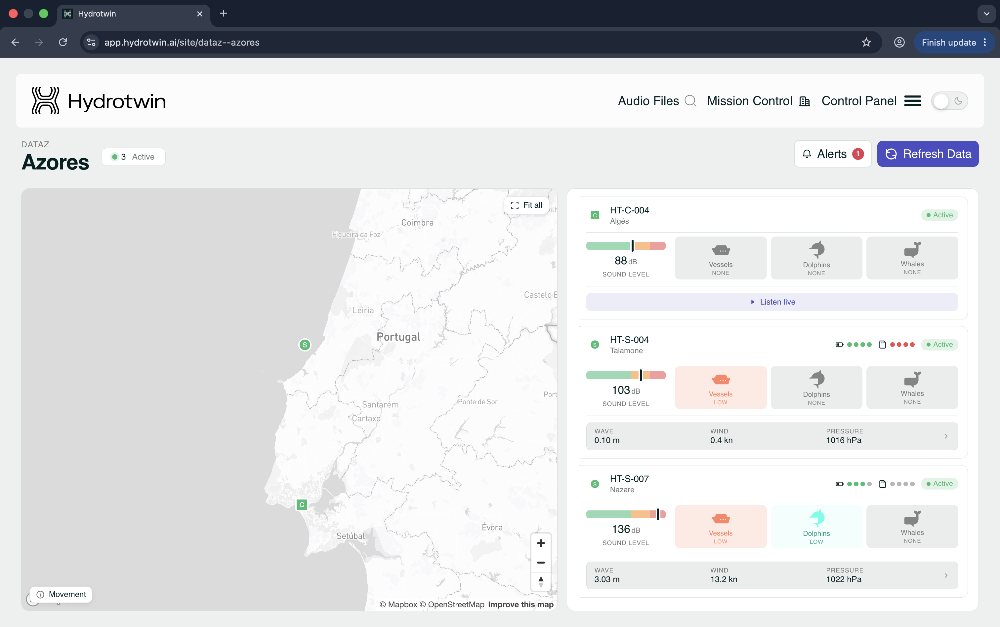

# Repository for the DATAz DTO Project GitHub
Public project number **2025.00265.DT4ST** financed by [ARTE](https://www.arte.gov.pt/). Developments were carried out by the DATAz consortium, which includes the following organisations: 
- [blueOASIS](https://blueoasis.tech/)
- [Instituto de Engenharia Mecânica](https://www.idmec.tecnico.ulisboa.pt/)
- [Instituto do Mar](https://imar.org.pt/en/about-us/)
- [Instituto Hidrográfico](https://www.hidrografico.pt/)
- [Centro de Experimentação Operacional da Marinha](https://ceom.marinha.pt/PT/Pages/WhatWeDo.aspx)
- [Associação para o Desenvolvimento e Formação do Mar dos Açores](https://www.emazores.pt/associacao/)
- [Direção Regional de Políticas Marítimas](https://portal.azores.gov.pt/web/drpm)

# Numerical Models
The DATAz DTO relies on a suite of numerical modelling tools to simulate the ocean environment around the Azores Free Technological Zone. These include:

- [MOHID](https://github.com/Mohid-Water-Modelling-System/Mohid): An open-source water modelling system developed by Instituto Superior Técnico to simulate hydrodynamic, environmental, and water quality processes across rivers, estuaries, coastal regions, and oceans.
- [RAINDROP](https://github.com/blueOceanSustainableSolutions/RAINDROP): A Python-based framework developed by blueOASIS to generate real-time holistic underwater acoustic maps, automating workflows including simulation setup, program execution, and data post-processing.
- [REEF3D](https://github.com/REEF3D/REEF3D): An open-source phase-resolved wave model developed by the Norwegian University of Science and Technology to simulate nearshore hydrodynamics over complex bathymetry and coastlines.
- [SWAN](https://gitlab.tudelft.nl/citg/wavemodels/swan): An open-source phase-averaged wave model developed by Delft University of Technology to simulate wind-generated waves in coastal regions and inland waters.
- [WW3](https://github.com/NOAA-EMC/WW3): A community-driven wave modelling framework providing global-to-regional spectral wave forecasts, used here for boundary forcing and validation.

The [`zlt_numerical_models`](zlt_numerical_models/) directory contains the configuration files, execution scripts, and post-processing tools used to set up, run, and analyse the numerical models supporting the DATAz DTO.

# AI-based Surrogate Models

The [`zlt_surrogate_models`](zlt_surrogate_models/) directory contains the data pre-processing and training pipelines used in the AI-based surrogates of the numerical models. For instance, the [`SWAN surrogate`](zlt_surrogate_models/SWAN/) uses Jupyter notebooks to handle boundary condition pre-processing, input preparation, and model training, enabling rapid approximation of wave conditions without running the SWAN numerical model. Similarly, the [`RAINDROP surrogate`](zlt_surrogate_models/RAINDROP/) uses Python scripts to train, evaluate, and predict the underwater radiated noise produced by ships without running the RAINDROP numerical model.

# DTO Visualisation

The DATAz DTO site is presented through open access on blueOASIS' DTO dashboard framework, accessed via https://app.hydrotwin.ai. For access, please email info@blueoasis.pt and state your use-case.  



A user guide is provided in [visualisation](visualisation). 

The Hydrotwin dashboard contains:

- **Live status panel**: Real-time Hydrotwin environmental readings, sensor status, and environmental measurement availability.
- **Detection timeline**: Chronological view of all detection events across modalities.
- **Alert management console**: Active alerts, historical alert log, and response action tracking.

The Hydrotwin dashboard encapsulates site-specific views, where:

- A single site (DATAz, Azores) shows a unified view of all sensors.
- Individual sensors can be selected for deeper analysis.
- In-situ sensors tied to an acoustic deployment can be viewed through individual sensor tabs.
- HT-C units offer a live listening mode.

# Getting Started

**1) Install Miniconda**

The [Python](https://www.python.org/) programming language is used extensively in several numerical and surrogate models within the DATAz DTO. To get started, install the [Miniconda](https://www.anaconda.com/docs/getting-started/miniconda/main) distribution, which provides a lightweight Python environment and package manager. You can download Miniconda on linux using e.g.:

```bash
curl -O https://repo.anaconda.com/miniconda/Miniconda3-latest-Linux-x86_64.sh
```

Please refer to the latest conda documentation for other operating systems. 

Once the download has completed, install Miniconda by running the following command in the terminal:

```bash
bash ./Miniconda3-latest-Linux-x86_64.sh
```

Press `Enter` to  review the license agreement. Once you have reached the end of the license agreement, type `yes` and press `Enter` to accept the license terms. Next, press `Enter` to install Miniconda in your `/home/<username>` directory. When prompted, type `yes` and press `Enter` to automatically initialize Conda. Lastly, refresh the terminal by running:

```bash
source ~/.bashrc
```

**2) Install DVC**

Large datasets and model checkpoints are **not stored directly in the GitHub repository**. Instead, they are hosted in a public Azure Blob Storage container and tracked via [DVC](https://dvc.org/). This enables efficient management of large files while keeping the Git repository lightweight. To install DVC, along with the required Azure storage support, run:

```bash
conda install "dvc[http]"
conda install dvc-azure
```

or use `pip` instead of `conda` 

If prompted to confirm the installation of any packages or dependencies, type `Y` and press `Enter` to proceed. Once the installation is complete, DVC is ready to download the repository datasets.

**3) Clone the repository**

The DATAz source code is hosted on [GitHub](https://github.com/blueOceanSustainableSolutions/DATAz/tree/master), and can be downloaded by cloning the repository to your local machine. Cloning creates a local copy of the repository, allowing you to access the codebase and track future updates. To clone the DATAz repository, run:

```bash
git clone https://github.com/blueOceanSustainableSolutions/DATAz.git
cd DATAz
```

**4) Pull the data**

Large datasets and model checkpoints are hosted in a public Azure Blob Storage container and tracked using DVC. Since the storage endpoint is publicly accessible, no authentication credentials are required. To configure the public DVC remote and download the repository data, run:

```bash
dvc remote add --local public https://datazstorage.blob.core.windows.net/dvcstore
dvc pull -r public
```

Depending on the speed of your internet connection, this process may take several minutes to complete. Once finished, all required data will be available locally and the repository will be ready for use.

<!---
To fetch only part of it, pass the path to a tracked file (or its `.dvc` pointer) — **not a folder**:

```bash
dvc pull -r public zlt_numerical_models/MOHID/GeneralData/Meteo/ERA5/era5.hdf5
```

> **Note:** pull over HTTPS, not the `azure://` remote. The container allows anonymous *reads* but not the operations the Azure client performs, so `azure://` + `allow_anonymous_login` hangs at `Collecting ... 0.00 entry/s` and then fails with `AuthorizationPermissionMismatch`. The HTTPS remote above avoids this entirely.
>
> **macOS / SSL:** if you see `CERTIFICATE_VERIFY_FAILED`, your Python has no CA bundle. Conda/most venvs are fine; a python.org install needs its `Install Certificates.command` run once (or `pip install certifi`).
-->

**5) Run the numerical models**

Once the data has been downloaded, navigate to the directory of the numerical model you wish to run. From within that model's folder, exectute the install script followed by the run script using:

```bash
cd zlt_numerical_models/<model_name>
bash scripts/install_<model_name>.sh
bash scripts/run_<model_name>.sh
```

For example, to install and run the RAINDROP model, execute the commands:

```bash
cd zlt_numerical_models/RAINDROP
bash scripts/install_raindrop.sh
bash scripts/run_raindrop.sh
```

Depending on the selected model, the setup process may take several minutes to complete. Please refer to the User Manual and the Developer Manual for information on configuration options, input data requirements, and model outputs.

# Adding Data to Blob Storage

The `public` remote configured in the previous section provides read-only access and can only be used to download repository data. Therefore, to upload new data to the Azure Blob Storage container, repository maintainers with the appropriate write permissions must use the default `azblob` remote. This remote is configured with the write credentials stored in the local `.dvc/config.local` file.

To start tracking a new file with DVC, first remove it from Git tracking and then add it to DVC. This ensures that the file is managed by DVC rather than being stored in the Git repository:

```bash
git rm --cached <path/to/file>
dvc add <path/to/file>
```

Running `dvc add` creates a lightweight `.dvc` metadata file and updates the corresponding `.gitignore` file such that the large data file is not committed to Git. Commit these changes to the repository:

```bash
git add <path/to/file>.dvc <its-folder>/.gitignore
git commit -m "Track <file> with DVC"
```

Once the changes are committed, upload the large data file to the DVC remote and push the Git commit:

```bash
dvc push
git push
```

To retrieve files that have been added by other contributors, first update your local Git repository, and then download the corresponding data from the `public` DVC remote:

```bash
git pull
dvc pull -r public
```
