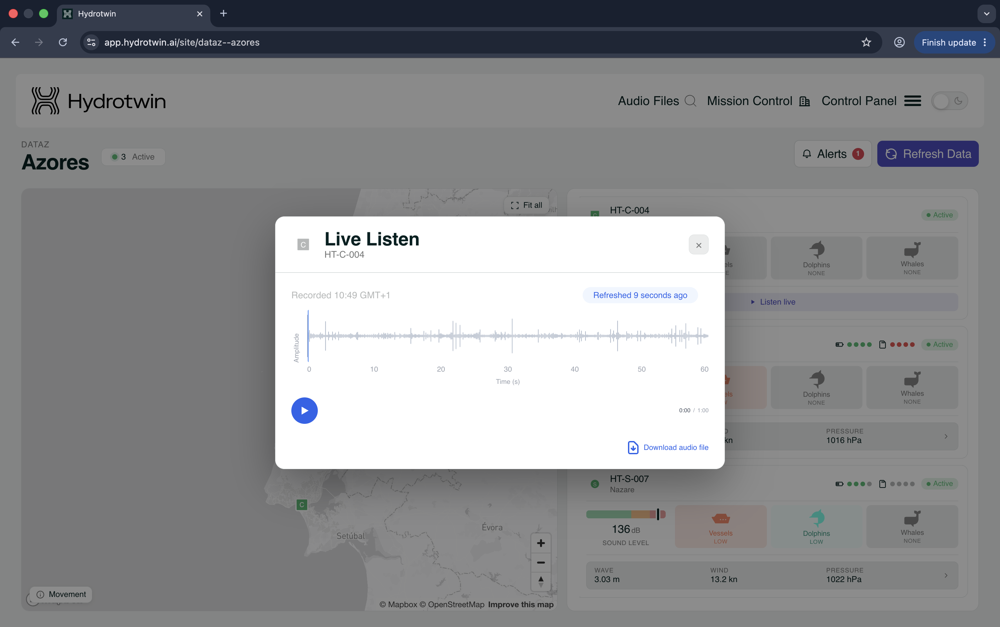
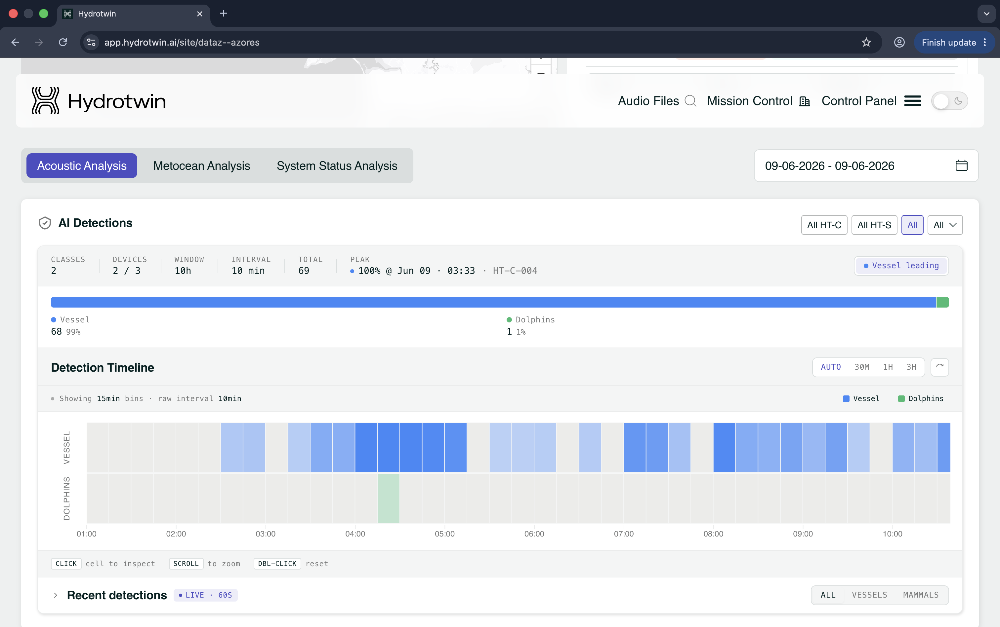
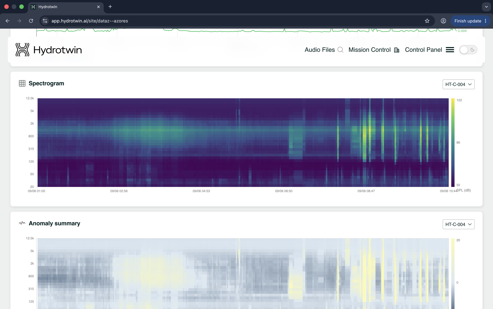
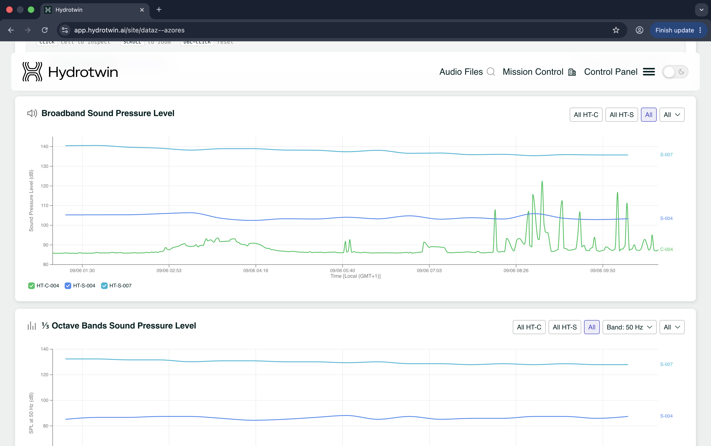
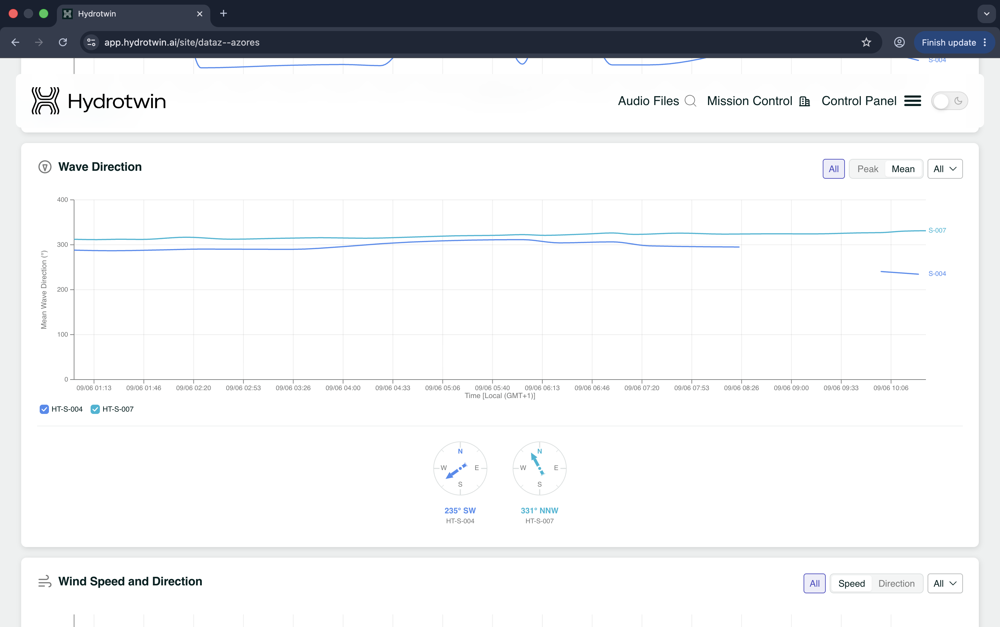
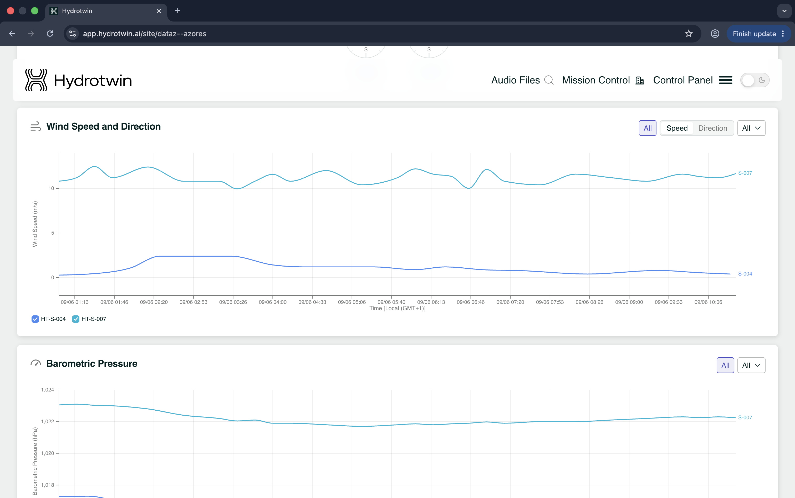
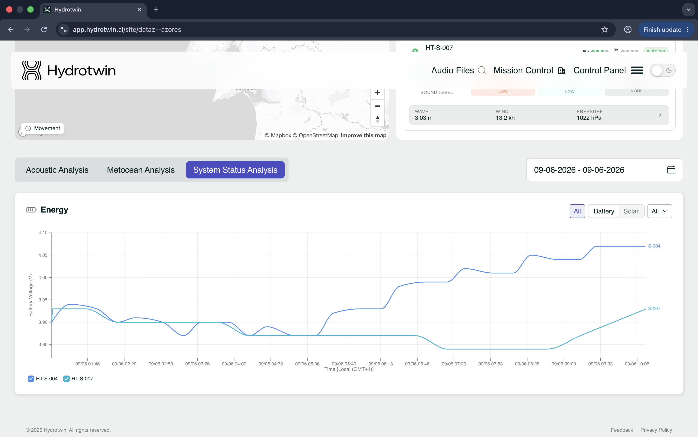
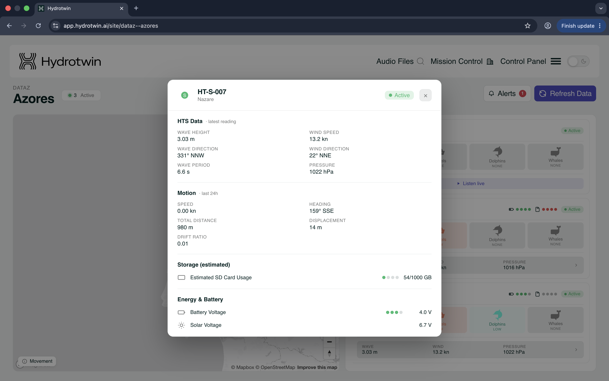

# Hydrotwin — Site Guide

*A quick guide to monitoring a site and exploring its data.*

This guide walks you through the Hydrotwin **site** of DATAz in the Azores: how to check what's happening live, and how to explore everything each device records. 

The webapp can be accessed from https://app.hydrotwin.ai. For access to the DATAz Site Location, please email info@blueoasis.pt and state your use-case.

## What you're looking at

Hydrotwin listens to the ocean — tracking vessel traffic, marine life, and underwater noise across an area of water. A **site** is one monitoring area, and it contains several **devices**: the sensors deployed there. This page is your single place to see what every device is detecting right now and what it has recorded over time.

There are two kinds of device:

| | **HT-C** (acoustic station) | **HT-S** (buoy) |
|---|---|---|
| Sound monitoring | Yes — including live listening | Yes |
| Environmental sensors | — | Yes |
| Power & position telemetry | — | Yes (battery, solar, motion/drift) |

The difference is one of focus: HT-C stations concentrate purely on sound, while HT-S buoys are self-powered and free-floating — so alongside their recordings they also report the sea conditions around them and their own status.

The page itself is in two parts: a **live snapshot** at the top, and **historical analysis** in the tabs below. The bar across the top stays with you throughout — use **Audio Files** to search recordings, or step out to **Mission Control** (all sites) and **Control Panel** (settings).

## Checking live status

The top of the page answers *"what's happening at the site right now?"* — it shows the latest readings the devices have sent in. **Refresh Data** pulls in the newest, and the **Alerts** badge (top right) flags anything that needs attention.

- **Map** — every device's current position. Use **Fit all** to frame them all, and turn on **Movement** to see how the buoys have drifted.
- **Device cards** — one per device, and the quickest read on the site. Each shows whether the device is **Active**, its current **Sound Level** (dB), and whether the detection model is hearing **vessels, dolphins, or whales** (rated None, Low, or higher). HT-S buoys add quick wave / wind / pressure figures plus small **battery** and **storage** gauges.
- **Listen live** (HT-C) — play the most recent audio straight from a station, or download the clip.
- **Open a card** — click any device for its full detail: the latest environmental reading, last-24h motion and drift, storage used, and battery / solar voltage.

## Exploring the data

Where the snapshot shows the present moment, the tabs below let you look back over time. **Set a date range** (top right) and it applies to every chart at once. On most charts you can also **filter by device type** (All HT-C / All HT-S / All) or **toggle individual devices** on and off using the legend — handy for comparing two devices or isolating one.

The data is grouped into three tabs.

### Acoustic Analysis — what each device has been hearing

This is where most of the monitoring happens: the sound each device recorded, what the detection model identified in it, and how loud the water has been.

- **AI Detections** — the headline of what was detected (vessels and marine mammals), how those detections break down by type, and when activity peaked. The **Detection Timeline** below lays them out over time as a heatmap — one row per type, darker meaning busier. Click any block to inspect that moment, and scroll to zoom in. **Recent detections** shows hits arriving live.
- **Spectrogram** — the full sound picture for a device (frequency over time, shaded by loudness). The fastest way to see *when* loud or unusual sound occurred.
- **Anomaly summary** — flags where the sound stands out from the device's normal baseline, so you can find the out-of-the-ordinary without reading every spectrogram.
- **Broadband Sound Pressure Level** — overall loudness per device over time; useful for comparing devices or tracking how noisy the site is getting.
- **⅓ Octave Bands** — loudness within a single frequency band you choose, for honing in on a particular noise source.

### Metocean Analysis — the environmental conditions

Sea state and water conditions reported by the HT-S buoys. This matters in its own right, and as context for the acoustics — wind and waves drive much of the background noise, and conditions influence where animals are and how clearly they're picked up. The same date range and filters apply, so you can compare buoys or focus on one.

- **Significant Wave Height** — how rough the sea is.
- **Wave Period** — the time between waves.
- **Wave Direction** — where the waves are coming from (shown with a compass rose).
- **Wind Speed and Direction**.
- **Barometric Pressure** — air pressure; a good early signal of changing weather.
- **Dissolved Oxygen** — oxygen content of the water, a key water-quality and ecological indicator.
- **Currents** — water current speed and direction.

### System Status Analysis — device health

For confirming the kit is running well — especially the HT-S buoys, which run on their own battery and solar out at sea, where you can't easily reach them. Keeping an eye on power and storage here is how you catch a problem before a device goes quiet.

- **Energy** — battery and solar voltage over time; the clearest sign of whether a buoy is charging and holding up.
- A device's **storage** (SD usage) and **motion / drift** are also available by opening its card up top.

