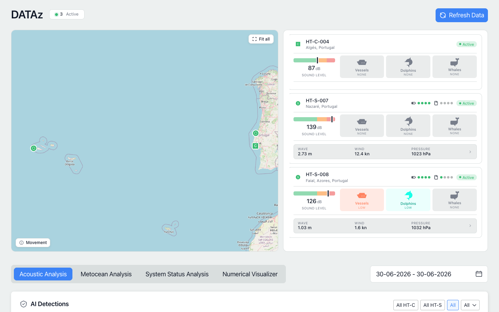
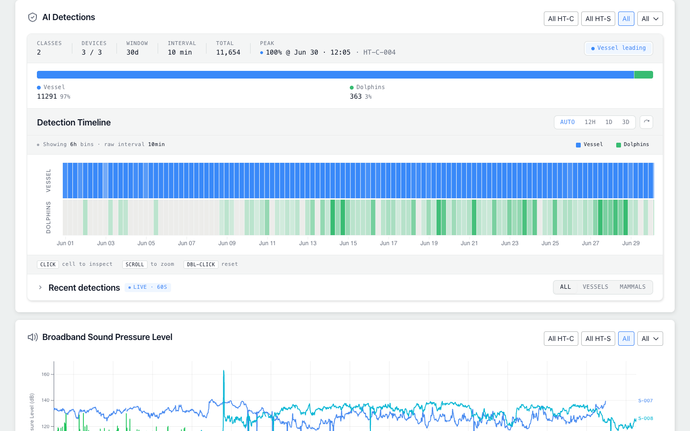
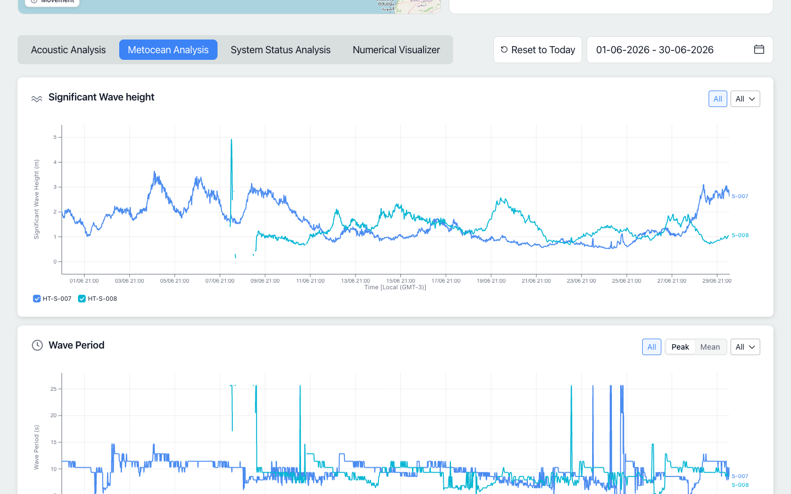
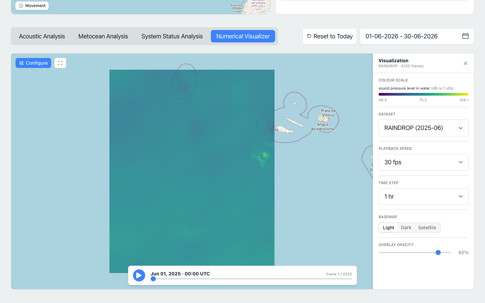

# DATAz — Site Monitoring Dashboard

A web dashboard for exploring a DATAz monitoring site: the marine devices deployed
there, their live status and movement, the acoustic and oceanographic measurements
they record, AI-classified sound detections, and time-animated numerical model
overlays of the surrounding ocean.

It is part of the [**DATAz** Digital Twin of the Ocean (DTO)](https://github.com/blueOceanSustainableSolutions/DATAz)
— a blueOASIS initiative that combines numerical ocean models with AI surrogates to
study the waters around the Azores Free Technological Zone. This repository is the
front-end visualization layer of that observatory.



**Live deployment → https://datazsite.z6.web.core.windows.net**

---

## Contents

- [What the dashboard shows](#what-the-dashboard-shows)
  - [Site overview](#site-overview)
  - [Acoustic analysis & AI detections](#acoustic-analysis--ai-detections)
  - [Metocean & environmental measurements](#metocean--environmental-measurements)
  - [Numerical Visualizer](#numerical-visualizer)
- [Running the dashboard](#running-the-dashboard)
- [Configuration](#configuration)
- [Project structure](#project-structure)
- [Technology](#technology)
- [License](#license)

---

## What the dashboard shows

The dashboard opens directly on a single monitoring site and is organized into a
**site overview** at the top and a set of **analysis tabs** below it. Every panel
updates against a shared date-range picker, and tabs only appear when there is data
to back them, so the view always reflects what the site is actually reporting.

### Site overview

The top of the page summarizes the site at a glance:

- A **map** of every device's position, with movement trails for drifting and
  vessel-mounted units and live status colouring (active / unresponsive).
- A **device rail** listing each unit with its location, status, and latest readings
  (for example, current sound level).
- A **status summary** in the header counting active and unresponsive devices, with a
  one-click data refresh.

### Acoustic analysis & AI detections

The **Acoustic Analysis** tab presents the underwater-sound picture for the selected
period: an AI-detections summary that classifies sounds (such as vessels, dolphins,
and other marine mammals), a detection timeline you can zoom and inspect bin by bin,
a live recent-detections feed, and broadband sound-pressure-level charts.



### Metocean & environmental measurements

The **Metocean Analysis** and **System Status Analysis** tabs chart the historical
time series each device records — significant wave height, wave period, wind,
temperature, and related environmental and system metrics — with per-device
selection and series toggles.



### Numerical Visualizer

The **Numerical Visualizer** plays time-animated raster overlays produced by the
DATAz numerical ocean models (for example, RAINDROP acoustic fields and WaveWatch III
wave conditions) directly on the map. Each overlay is a sequence of model frames you
can scrub or play back as an animation.

A side configuration panel lets you choose the **dataset** and **variable**, set the
**playback speed** and the **time step** between frames, switch the **basemap**
(light / dark / satellite), and adjust **overlay opacity** — with a colour-scale legend
that always reflects the range the frames were rendered with. The bottom bar holds
play / pause and a frame scrubber.



---

## Running the dashboard

You only need [Node.js](https://nodejs.org/) **20 or newer** installed. No backend,
database, or external services need to be set up — the dashboard ships pointed at the
hosted DATAz backend and loads real site data out of the box.

```bash
# 1. Install dependencies
npm install

# 2. Start the development server
npm run dev
```

Then open the URL printed in the terminal (by default **http://localhost:5173**).

To produce and preview an optimized production build instead:

```bash
npm run build      # outputs static files to dist/
npm run preview    # serves the built app locally
```

The `dist/` folder is a self-contained static site and can be hosted on any static
web host or served behind the main DATAz application.

---

## Configuration

**No configuration is required to run the dashboard.** Sensible production defaults
are built in (see `src/config.js`), so a fresh clone connects to the hosted DATAz
backend automatically.

If you ever need to point the dashboard at a different deployment, you can override
the defaults with environment variables. Copy the provided example file and edit only
the values you need:

```bash
cp .env.example .env
```

| Variable                    | Default                       | Purpose                                                                    |
| --------------------------- | ----------------------------- | -------------------------------------------------------------------------- |
| `VITE_API_BASE_URL`         | Hosted DATAz backend          | Backend API base URL (including its `/api` suffix).                        |
| `VITE_API_KEY`              | Read-only access key          | Sent with each request to authorize read-only access to site data.        |
| `VITE_SITE_ID`              | _unset_                       | Pin a specific site id. When unset, the first accessible site is used.    |
| `VITE_PAGE_TITLE`           | `DATAz`                       | Title shown in the page header and the browser tab.                       |
| `VITE_ENABLE_NUMERICAL_VIZ` | `true`                        | Show the Numerical Visualizer tab. Set to `false` to hide it.             |

> These values are bundled into the browser build, so the bundled key is intended for
> read-only public access only.

---

## Project structure

```
src/
├── main.jsx        # App entry — React root and providers (data, theme, timezone)
├── App.jsx         # The page: header + map + device rail + analysis tabs
├── config.js       # Build-time configuration (API URL, key, feature flags)
├── api/            # Data-fetching layer for the DATAz backend
├── hooks/          # Data hooks (site, measurements, detections, overlays)
├── components/     # UI components, including charts/ and the overlay viewer
├── constants/      # Chart catalogue, device-type and status registries
├── lib/            # Pure helpers (dates, geometry, formatting, spectrogram…)
├── context/        # Theme and timezone providers
└── styles/         # Tailwind + SCSS theme
```

---

## Technology

- **[React](https://react.dev/)** + **[Vite](https://vitejs.dev/)** — single-page app, plain JavaScript.
- **[TanStack Query](https://tanstack.com/query)** — data fetching and caching.
- **[MapLibre GL](https://maplibre.org/)** — interactive maps and overlay rendering, using free OpenStreetMap / CARTO tiles (no map-provider token required).
- **[D3](https://d3js.org/)** — charts and data visualization.
- **[Tailwind CSS](https://tailwindcss.com/)** + SCSS — theming and layout.

---

## License

This repository is part of the [DATAz Digital Twin of the Ocean (DTO)](https://github.com/blueOceanSustainableSolutions/DATAz)
project and is distributed under the same terms as the main DATAz repository.
See that repository's `LICENSE` for details.
